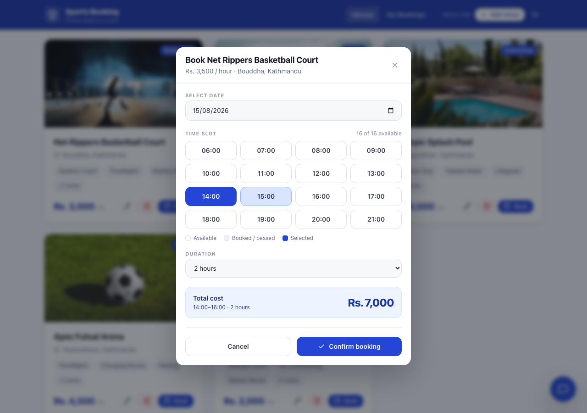
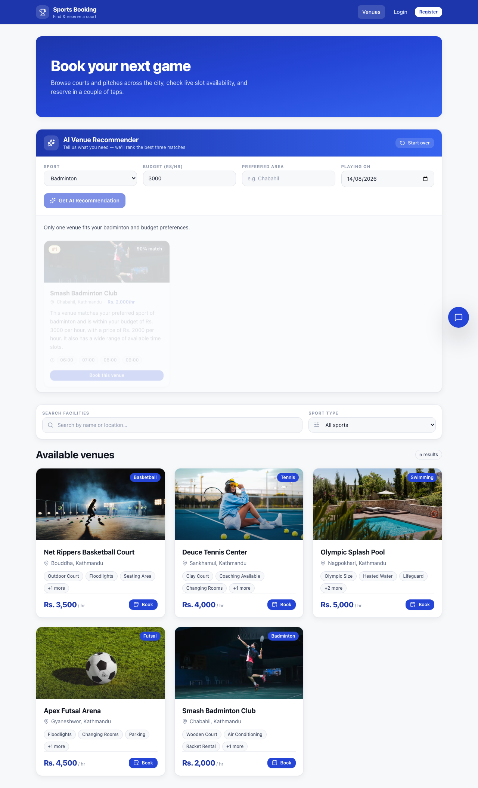
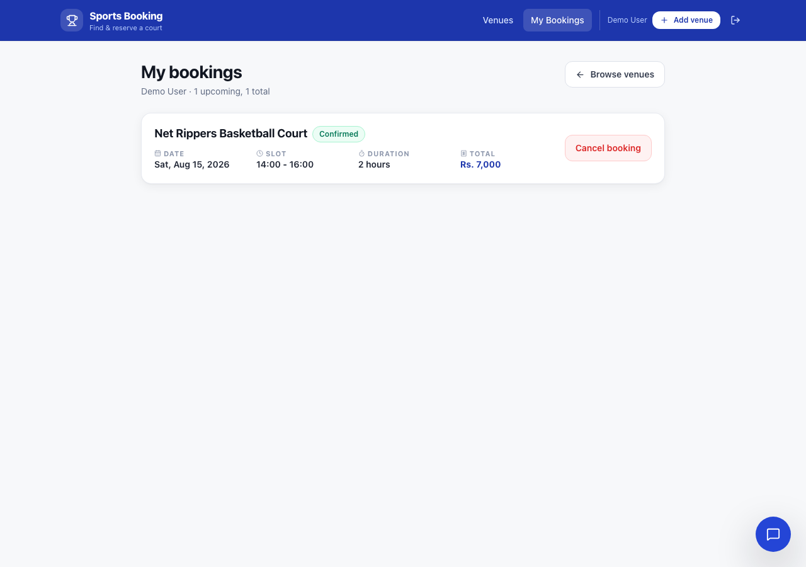
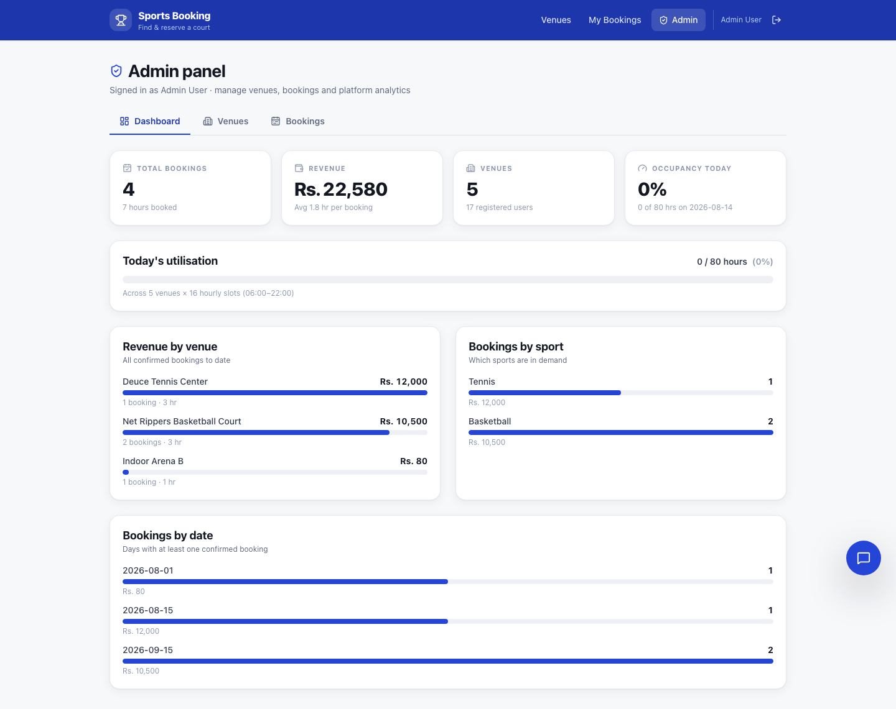
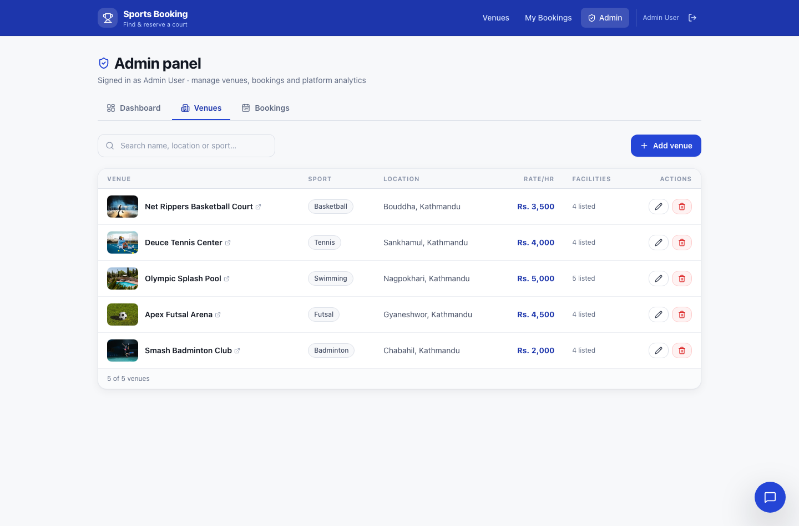

# 🏟️ Sports Venue Booking System

A full-stack web app for browsing sports venues, checking live hourly slot
availability, and booking courts by the hour.

**Stack:** React 19 · Tailwind CSS · Node.js · Express 5 · MongoDB (Mongoose) · JWT · Groq AI

---

## Live URLs

| Service | URL |
| --- | --- |
| Frontend (Netlify) | https://sportsvenuebooking.netlify.app |
| Backend (Render) | _set to your Render service URL_ |

> Update the backend row once the Render service is deployed, and set
> `VITE_API_URL` in Netlify to that URL.

---

## Screenshots

| Venue listing | Booking slot picker |
| --- | --- |
|  |  |

| AI recommendations | My bookings |
| --- | --- |
|  |  |

| Admin dashboard | Admin venue management |
| --- | --- |
|  |  |

---

## Features

- **Venue catalogue** — cards showing image, sport type, location, hourly price and facilities
- **Search & filter** — by venue name or location, plus a sport-type filter
- **Live slot availability** — hourly slots from 06:00–22:00, with booked and
  already-passed slots visibly disabled
- **Double-booking prevention** — overlapping reservations are rejected server-side
- **Automatic cost calculation** — recomputed on the server, never trusted from the client
- **JWT authentication** — register, login, logout; bookings scoped to the logged-in user
- **My Bookings** — view and cancel reservations, which releases the slots again
- **Booking statistics** — MongoDB aggregation pipeline over bookings and revenue
- **AI recommender** — top 3 venues with reasons, ranked on sport, budget, location and free slots
- **AI chat assistant** — a grounded multi-turn assistant that only discusses real inventory
- **Admin panel** — venue management, booking oversight across all users, and platform analytics

---

## Admin panel

Reachable at `/admin` for accounts with `role: "admin"`. Regular users see no
Admin link, and hitting the URL directly returns an explicit "admin access
required" screen rather than a silent redirect.

| Section | What it does |
| --- | --- |
| **Dashboard** | Headline stat tiles (bookings, revenue, venues, today's occupancy), today's utilisation meter, and revenue/bookings broken down by venue, sport and date |
| **Venues** | Sortable table of the whole catalogue with add / edit / delete, plus search across name, location and sport |
| **Bookings** | Every booking across all users, filterable by venue, date, period and free-text search over venue name / customer name / email. Admins can cancel on a customer's behalf |

### Creating an admin

There are two ways. A `role` sent in the registration request body is always
ignored — these are the only paths that grant admin.

**1. Admin signup code (self-service)**

Set `ADMIN_SIGNUP_CODE` in `backend/.env` (minimum 12 characters; the server
refuses to start with a shorter one):

```bash
node -e "console.log(require('crypto').randomBytes(12).toString('base64url'))"
```

The register form then shows a collapsed **"Have an admin code?"** section.
Anyone entering the correct code is created as an admin. Leave the variable
unset and the field disappears entirely — the feature fails closed.

Protections: the code is never sent to the browser (`/api/auth/signup-config`
only reports whether the field exists), comparison is constant-time, and five
wrong codes from one IP triggers a 15-minute lockout. Normal registration is
never affected by that throttle.

**2. CLI promotion (no code needed)**

```bash
cd backend
npm run make-admin -- you@example.com     # promote
npm run make-admin -- you@example.com --demote
npm run make-admin -- --list              # show current admins
```

Either way, sign out and back in afterwards so the session picks up the new
role — it's baked into the JWT at login.

### Permissions

| Action | Guest | User | Admin |
| --- | :---: | :---: | :---: |
| Browse venues, view availability | ✅ | ✅ | ✅ |
| Book / cancel own booking | — | ✅ | ✅ |
| Create / edit / delete venues | — | — | ✅ |
| View all users' bookings | — | — | ✅ |
| Cancel anyone's booking | — | — | ✅ |
| Platform analytics | — | — | ✅ |

---

## Project structure

```
sports-venue-booking/
├── backend/
│   ├── config/          # db connection, JWT config, slot definitions
│   ├── controllers/     # venue, booking, auth, AI handlers
│   ├── middlewares/     # JWT auth guard
│   ├── models/          # Mongoose schemas
│   ├── routes/          # Express routers
│   ├── services/        # Groq AI integration
│   ├── validators/      # express-validator rules
│   └── data/seed.js     # seeds 5 sample venues
├── frontend/
│   └── src/
│       ├── api/         # HTTP layer (axios)
│       ├── components/  # VenueCard, VenueList, BookingModal, AI panel, ui/
│       ├── context/     # AuthContext
│       ├── pages/       # Home, VenueDetail, MyBookings, Login, Register, 404
│       └── utils/       # local-timezone date helpers, image constants
└── .github/workflows/   # CI
```

---

## Getting started

### Prerequisites

- Node.js 20+
- A MongoDB Atlas cluster
- A [Groq API key](https://console.groq.com/keys)

### 1. Install

```bash
npm run install:all
```

### 2. Configure environment

```bash
cp backend/.env.example backend/.env
cp frontend/.env.example frontend/.env
```

Fill in `backend/.env`:

| Variable | Required | Purpose |
| --- | --- | --- |
| `MONGODB_URI` | ✅ | MongoDB Atlas connection string |
| `JWT_SECRET` | ✅ | Long random string used to sign tokens |
| `GROQ_API_KEY` | ✅ | Powers the AI recommender and chat |
| `PORT` | — | Defaults to `3000` |
| `FRONTEND_URL` | — | Deployed frontend origin, for CORS |
| `NODE_ENV` | — | `development` or `production` |

The server refuses to start without `MONGODB_URI` or `JWT_SECRET` rather than
running with an insecure fallback.

### 3. Seed sample venues

```bash
npm run seed
```

Inserts the 5 sample venues, replacing any existing ones.

### 4. Run

```bash
npm run dev:backend    # http://localhost:3000
npm run dev:frontend   # http://localhost:5173
```

---

## API reference

### Venues

| Method | Route | Auth | Description |
| --- | --- | --- | --- |
| `GET` | `/api/venues` | — | List all venues |
| `GET` | `/api/venues/:id` | — | Single venue |
| `GET` | `/api/venues/:id/availability?date=YYYY-MM-DD` | — | Hourly slots with booked/past flags |
| `POST` | `/api/venues` | 🛡️ | Create a venue |
| `PUT` | `/api/venues/:id` | 🛡️ | Update a venue |
| `DELETE` | `/api/venues/:id` | 🛡️ | Delete a venue and its bookings |

🛡️ = admin only. ✅ = any signed-in user.

### Admin

| Method | Route | Auth | Description |
| --- | --- | --- | --- |
| `GET` | `/api/admin/bookings` | 🛡️ | All bookings; filters: `venueId`, `date`, `search`, `scope` |
| `DELETE` | `/api/admin/bookings/:id` | 🛡️ | Cancel any user's booking |
| `GET` | `/api/admin/analytics` | 🛡️ | Totals, occupancy, and breakdowns by venue / sport / date |

### Bookings

| Method | Route | Auth | Description |
| --- | --- | --- | --- |
| `GET` | `/api/bookings` | ✅ | Current user's bookings |
| `GET` | `/api/bookings/stats` | ✅ | Aggregated booking statistics |
| `POST` | `/api/bookings` | ✅ | Create a booking |
| `DELETE` | `/api/bookings/:id` | ✅ | Cancel a booking, freeing its slots |

### Auth

| Method | Route | Auth | Description |
| --- | --- | --- | --- |
| `POST` | `/api/auth/register` | — | Create an account, returns a JWT |
| `POST` | `/api/auth/login` | — | Log in, returns a JWT |
| `POST` | `/api/auth/logout` | — | Clear the auth cookie |
| `GET` | `/api/auth/me` | ✅ | Current user profile |

### AI

| Method | Route | Auth | Description |
| --- | --- | --- | --- |
| `POST` | `/api/ai/recommend` | — | Top 3 recommendations with reasons |
| `POST` | `/api/ai/chat` | — | Multi-turn assistant grounded in real venues |

`POST /api/ai/recommend` accepts `{ sportType, budget, location, date, notes }`
and returns:

```json
{
  "success": true,
  "summary": "…",
  "recommendations": [
    {
      "venue": { "_id": "…", "name": "…", "pricePerHour": 2000 },
      "matchScore": 90,
      "reason": "Within your Rs. 3000 budget and free in the evening.",
      "bestSlots": ["18:00", "19:00"]
    }
  ]
}
```

Venue ids returned by the model are resolved against the database, so a
hallucinated venue is dropped rather than rendered.

---

## Data models

**Venue** — `name`, `sportType`, `location`, `pricePerHour`, `facilities[]`, `imageUrl`, `availability`

**Booking** — `user`, `venue`, `venueName`, `date`, `startTime`, `duration`,
`slots[]`, `slot`, `totalCost`, `status`

`slots[]` holds every hourly slot a booking occupies (e.g. `["10:00", "11:00"]`),
which is what makes availability lookups and overlap detection exact.

**User** — `name`, `email` (unique), `password` (bcrypt, 12 rounds), `role`, `phone`

---

## Deployment

### Backend (Render)

- Root directory: `backend`
- Build command: `npm install`
- Start command: `npm start`
- Environment: set `MONGODB_URI`, `JWT_SECRET`, `GROQ_API_KEY`, `FRONTEND_URL`, `NODE_ENV=production`

### Frontend (Netlify)

Configured in `netlify.toml` (base `frontend`, publish `dist`).
Set `VITE_API_URL` to the Render backend URL in Netlify's environment settings.

### CI

`.github/workflows/ci.yml` lints and builds the frontend, verifies every backend
module parses, and checks that required environment variables stay documented in
`.env.example`.

---

## Security notes

- `.env` files are gitignored; only `.env.example` templates are committed
- Passwords are hashed with bcrypt and excluded from queries by default
- Venue writes require a valid JWT
- Bookings are scoped to the authenticated user — one user cannot read or
  cancel another's
- CORS rejects unrecognised origins in production
